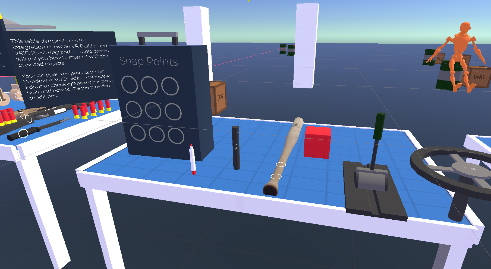
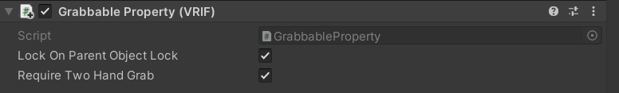
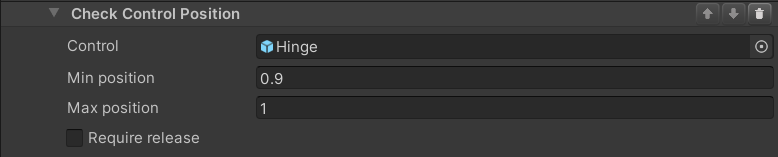

# VRIF Interaction Component for VR Builder
## Table of Contents

1. [Introduction](#introduction)
1. [Installation](#installation)
    - [Requirements](#requirements)
    - [How to Install](#how-to-install)
1. [Quick Start](#quick-start)
1. [Differences from XRIT](#differences-from-xrit)
1. [Properties](#data-properties)
    - [Grabbable Property](#grabbable-property)
    - [Touchable Property](#touchable-property)
    - [Usable Property](#usable-property)
    - [Snappable/Snap Zone Property](#snappablesnap-zone-property)
    - [Lever/Wheel Property](#leverwheel-property)
1. [Check Control Position Condition](#check-control-position-condition)
1. [Contact](#contact)

## Introduction

VR Builder is a tool for quickly creating sequential interactive processes, like for example tutorials, by using an easy to use visual editor. This add-on allows to use VR Builder together with VR Interaction Framework. It makes it possible for VR Builder to know when the user grabs something, if a lever has been pulled and so on. This way, it is possible to replace VR Builder's default interaction framework (XRIT) with VRIF, in order to leverage the unique strengths of the latter.

## Installation

### Requirements
- This add-on requires VR Builder version 2.2.0 or later to work.
- This add-on is based on VRIF 1.81. Earlier versions might work, but they are untested.

### How to Install

1. First, ensure that both VRIF and VR Builder are present in the project.
1. As you are using a different interaction component, it is recommended to disable VR Builder's default interaction component. To do so, open `Project Settings > VR Builder > Settings` and uncheck `Enable built-in XR Interaction Component`.
1. Navigate to `Assets/BNG Framework/Integrations/VR Builder` and import the Unity package for this add-on.
1. Done! Now you can either open the demo scene from `Tools > VR Builder > Demo Scenes > VRIF Integration` or create a new VR Builder scene using the wizard by selecting `Tools > VR Builder > New Process Wizard...`.

Note: VR Builder imports the XR Interaction Toolkit as a requirement for the built-in interaction component. If you don't need it, it is possible to remove it from the Package Manager after disabling the interaction component.

## Quick Start

If you are new to VR Builder, we strongly suggest getting familiar with the basics in the core [documentation](https://www.mindport.co/vr-builder/manual/introduction), also available in the asset's folder.

Otherwise, the best way to start is probably the demo scene. A simple process will let you try all the integrated interactions one by one, and you will be able to check the process and the objects to see how they are configured.
The first time you open the demo scene, you should do so from the menu: `Tools > VR Builder > Demo Scenes > VRIF Integration`. This will copy the process JSON in the StreamingAssets folder. The process will not work otherwise.

The VR Builder demo is limited to a single table in a copy of the VRIF demo scene. You will be instructed by the VR Builder process to interact with the objects one by one, thus testing every interaction provided.

## Differences from XRIT

VR Builder's interaction framework is by default the XR Interaction Toolkit by Unity. This add-on includes modified versions of some components so that VR Builder "understands" an interaction in VRIF instead of XRIT. However, while the exact same conditions are used, their functionality does not map one to one.
Since the frameworks are different, interactions are handled in a different way and some components, e.g. snap zones, offer a different feature set.
These differences are listed in the property descriptions below.

At this time, the restrictive environment feature is not supported with VRIF. With restrictive environment enabled, an object would be for example grabbable only if the user is supposed to grab it in the current step, and could revert to non-interactable afterwards. Currently, VR Builder does not modify in any way the interactability of an object. It will just check if it is interacted with at the appropriate times, so the process can proceed. If you need an object to become non-interactable at some point, you will have to do that manually.

## Properties

This integration includes the following properties. Most of those work with the standard VR Builder conditions and are replacements for similar properties in the built-in XR Interaction Component. Lever and Wheel properties are unique to this integration and allow to check the position on levers and wheels respectively thanks to a bespoke condition.

### Grabbable Property
The included `Grabbable Property` allows to use the standard Grab Object and Release Object conditions with the VRIF grabbers and grabbables. Adding it to a game object will automatically add the `Grabbable` and `Grabbable Unity Events` components from VRIF.

Note that a rigidbody is not automatically added to the object, as the `Grabbable` component can be also used without in some cases. However, if you want a "standard" grabbable object, you should add one manually.

An additional feature of this implementation is the possibility to require a two hand grab by ticking the corresponding checkbox on the component itself. In this case, the object will count as grabbed only if grabbed with both hands.
Note that this does not inherently change the behavior of the object, for example by preventing the user from grabbing it with one hand only. It only defines what VR Builder considers a valid grab on the object.

### Touchable Property
Allows to use the Touch Object condition with VRIF. Internally, it uses the `onBecomesClosestGrabbable` event to consider the object touched.

### Usable Property
This property qualifies the object as "in use" based on the `onTriggerDown` event on the `Grabbable Unity Events` component. It works similarly to the `Usable Property` in the built-in XR Interaction Component, with the difference that the object can always be used as long as it's grabbed (i.e. this property is not locked).

### Snappable/Snap Zone Property
These allow to use VRIF snap zones in a VR Builder process. Note that snap zones in VRIF, contrary to the one in the built-in XR Interaction component, don't snap one specific object by default. The `Snap Zone Property` does not perform any automatic configuration on the snap zone itself. Please refer to the VRIF demos and documentation to configure the snap zones.

### Lever/Wheel Property
These can be added to a game object with respectively the `Lever` or `Driving Wheel` component. The object can then be used in the `Check Control Position` condition.

## Check Control Position Condition
### Description

This condition triggers when a movable object like a lever or a wheel reaches a position within a range. The position is normalized from 0 (down) to 1 (up) for a lever, and from -1 to 1 for a driving wheel.

#### Configuration

- **Control**

    The object whose position we want to check. The game object referenced here should be the one with the `Lever` or `Driving Wheel` component, not necessarily the root object. Please manually add a `Lever Property` or `Wheel Property` instead of relying on the `Fix it` button. As they are implementations of the same interface, it is not possible at this time to automatically select the correct property.

- **Min position**

    The minimum position which will be considered valid by the condition.

- **Max position**

    The maximum position which will be considered valid by the condition.

- **Require release**

    If this is checked, the condition will not complete until the object is released. This will require the user to place the object in the correct position and release it instead of just moving it back and forth until something happens.

## Contact

Join our official [Discord server](http://community.mindport.co) for quick support from the developer and fellow users. Suggest and vote on new ideas to influence the future of the VR Builder.

Make sure to review [VR Builder](https://assetstore.unity.com/packages/tools/visual-scripting/vr-builder-201913) if you like it. It will help us immensely.

If you have any issues, please contact [contact@mindport.co](mailto:contact@mindport.co). We'd love to get your feedback, both positive and constructive. By sharing your feedback you help us improve - thank you in advance!
Let's build something extraordinary!

You can also visit our website at [mindport.co](http://www.mindport.co).